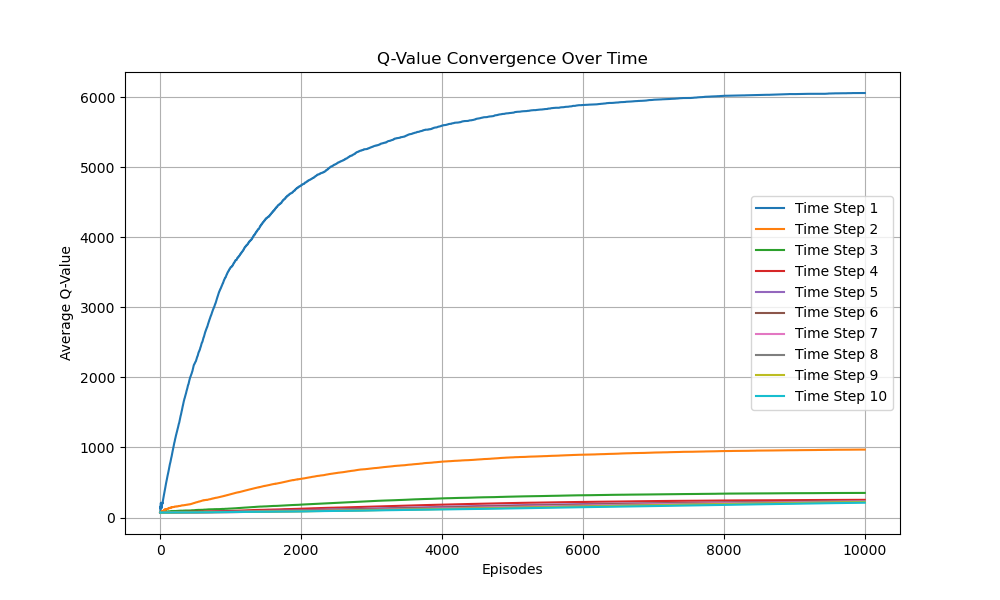
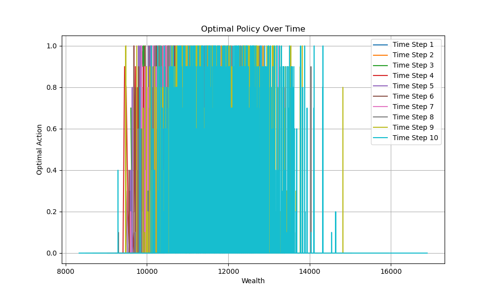
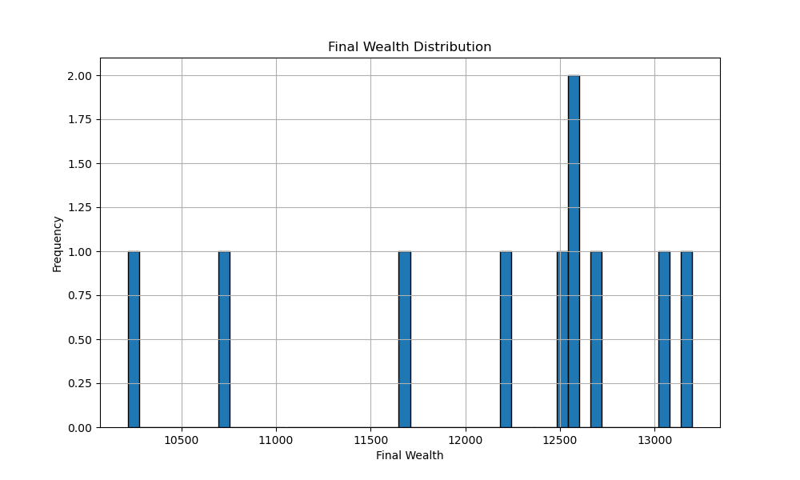
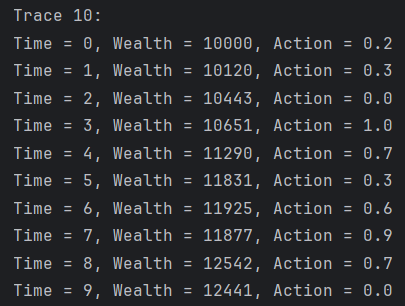

# MAFS5370-Assignment1
###  - SHEN Hengyu

# Asset Allocation Based on Reinforcement Learning

Wealth allocation is a fundamental challenge in finance and economics, as it revolves around determining the optimal distribution of resources across various assets to maximize returns while minimizing risk. In this report, we employ reinforcement learning techniques to tackle the wealth allocation problem within the framework of a portfolio comprising a risky asset and a risk-free asset. By leveraging the principles of reinforcement learning, we aim to identify strategies that balance risk and reward effectively, ultimately optimizing the allocation of wealth to achieve superior financial outcomes.

---

## Problem Description

The investor needs to allocate investments between two assets: a risk-free asset and a risky asset. The risky asset has two possible return rates: \( a \) and \( b \), with probabilities \( p \) and \( 1-p \), respectively. The risk-free asset has a constant return rate \( r \). The objective is to find the optimal investment strategy to maximize the expected utility of terminal wealth.

---

## Code Structure

The code is organized into the following files:

1. **`TemporalDifference_QLearning.py`**  
   Implements the Q-learning algorithm to update the state-action value function (Q-function). Key functionalities include:
   - Initializing the Q-function.
   - Calculating the utility function.
   - Training the Q-learning model.
   - Computing average Q-values to track convergence.

2. **`Evaluation_Metrics.py`**  
   Provides evaluation and visualization functions, including:
   - Plotting Q-value convergence curves.
   - Plotting policy change graphs.
   - Plotting final wealth distribution.

3. **`main.py`**  
   The main program responsible for initializing parameters, training the Q-learning model, and generating visualization results.

---

## Workflow

1. **Initialize Parameters**  
   In `main.py`, the following parameters are initialized:
   - Time horizon (`time_horizon`).
   - Initial wealth (`initial_wealth`).
   - Return rates of the risky asset (`risky_return_up` and `risky_return_down`).
   - Return rate of the risk-free asset (`risk_free_rate`).
   - Action space (`action_options`).

2. **Train the Q-learning Model**  
   The `train_q_learning` function is called to train the model, returning the updated Q-function and convergence data.

3. **Test the Optimal Policy**  
   Using the trained Q-function, 10 random traces are generated, and the terminal wealth for each trace is recorded.

4. **Generate Visualization Results**  
   Functions from `Evaluation_Metrics.py` are called to generate the following plots, which are saved in the `plots` folder:
   - Q-value convergence curve (`convergence_plot.png`).
   - Policy change graph (`policy_plot.png`).
   - Final wealth distribution (`wealth_distribution.png`).

---

## Outcomes

1. **Q-value Convergence**  

2. **Policy Change**  

3. **Final Wealth Distribution**  

4. **Trace 10's Optimal Strategy**  

---

